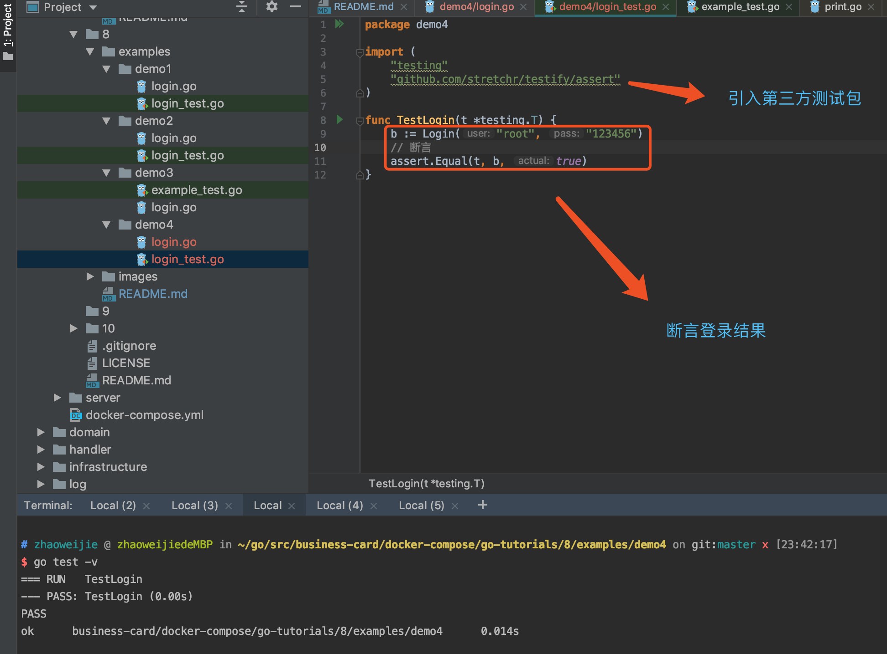

## 测试
> go语言拥有一套单元测试、性能测试系统和示例测试，仅需要添加很少的代码就可以快速测试一段需求代码
> testing 包提供自动测试支持, 它与"go test"命令一起使用, 该命令自动执行*_test.go源文件中以Test、Benchmark和Example前缀的函数

**为什么要些测试？**

[更多如何写好单元测试文章](https://www.jianshu.com/p/1cb94e6508b8)
```sh
目的：
1. 提高软件质量
2. 减少bug
3. 减少重复的工作
4. 安全的重构已有的代码
5. 让开发者对程序稳定性更有信心

重要性：
1. 运行单元测试是为了保证代码的行为和我们期望的结果一致。
2. 写单元测试会增加代码工作量,同时也节约了bug修复时间。
3. 如果没有写单元测试，没有发现bug的情况下，程序在测试人员测试的时候才发现问题或者在线上环境(正式环境)用户使用才发现问题，在去修复bug。开发会花大量的精力去修复bug和走部署流程，测试也会花大量的时间去做了重复的测试。很不划算。
4. 在线上某些场景下bug导致大量的数据丢失,需要花很大精力去修复数据，或者根本没办修复数据导致严重的后果。
```


```go
1. Test功能测试函数
2. Benchmark基准测试函数
3. Example示例函数
4. 使用流行开源的测试包(github.com/stretchr/testify)
5. 打桩测试
6. 代码覆盖率
7. 性能剖析
```

###### 1. Test功能测试函数

> 1. 每个测试文件都必须导入testing包
> 2. 功能测试函数必须以Test为开头(前缀)

```go
// 文件: *_test.go
func TestXxx(t *testing.T) {
    // 执行代码
    ...
}
```

**功能测试示例**
> 1. 创建examples/demo1/login.go
> 2. 创建examples/demo1/login_test.go
> 3. 运行测试

> 1. 创建examples/demo1/login.go并添加一下内容
```go
// examples/demo1/login.go
package demo1

// Login 登录
func Login(user, pass string) bool {
	if user == "root" && pass == "123456" {
		return true
	}
	return false
}
```
> 2. 创建examples/demo1/login_test.go并添加一下内容

```go
// examples/demo1/login_test.go
package demo1

import "testing"

// 成功的测试
func TestLoginSuccess(t *testing.T) {
	user := "root"
	pass := "123456"
	isLogin := Login(user, pass)
	// 登录失败
	if !isLogin {
		t.Errorf("user=%s,pass=%s, 用户名必须是root,密码必须是123456", user, pass)
	}
}

// 失败的测试
func TestLoginFail(t *testing.T) {
	user := "admin"
	pass := "123456"
	isLogin := Login(user, pass)
	// 登录失败
	if !isLogin {
		t.Errorf("user=%s,pass=%s, 用户名必须是root,密码必须是123456", user, pass)
	}
}
```
> 3. 运行测试
```sh
# 进入目录
cd examples/demo1
# 运行测试
go test -v
```


###### 2. Benchmark 基准测试函数
> 1. 基准测试可以测试一段程序在给定的工作负载下检测程序性能的一种方法, 可以测试一段程序的运行性能及耗费CPU的成都.
> 2. go语言提供了基准测试框架,使用方式和功能测试类似
> 3. 使用者无需准备高精度的计时器和各种分析工具, go语言的基准测试本身就可以打印出非常标准的测试报告.

```go
// 文件: *_test.go
// 基准测试声明
func BenchmarkXxx(b *testing.B) {
    for i := 0; i < b.N; i++ {
        // 执行代码
    }
}
```

**基准测试示例**
> 代码请看本目录下examples/demo2包
```sh
# 进入目录
cd examples/demo2
# 运行所有基准测试
go test -bench=. -v

```


###### 3. Example示例函数
> Example示例函数主要目的作为文档, 与带注释的示例不同的是, Example示例函数是真实的go语言代码, 必须通过编译时检查,所以随着代码的进化它们也不会过时

```go
// 文件: example_test.go
// Example示例函数声明
func ExampleXxx() {
	// 执行代码
	...
}
```

**Example示例函数示例**
> 代码请看本目录下examples/demo3包
```sh
# 进入目录
cd examples/demo3
# 运行所有基准测试
go test -v

```


###### 4. 使用流行开源的测试包(github.com/stretchr/testify)

**特点**
> 1. 快速断言(assertions)
> 2. 打桩(mocking)
> 3. 套件(suite)和功能(function)

**示例**
> 代码请看本目录下examples/demo4包
```sh
# 进入目录
cd examples/demo4
# 运行所有基准测试
go test -v

```
