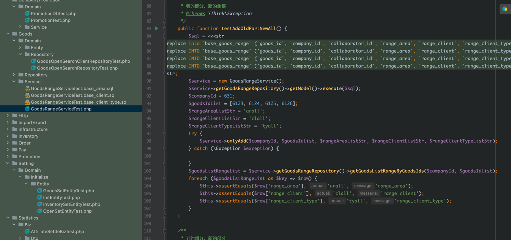
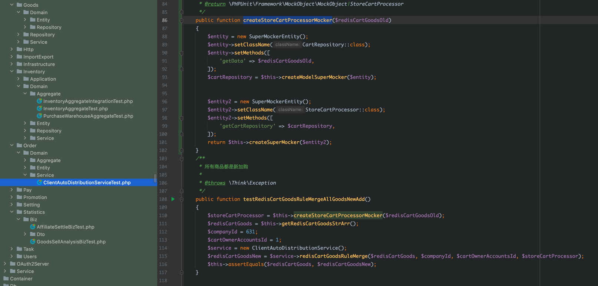

# 项目问题

```
1. 测试环境发版太慢,现在发版一次需要1分钟以上很浪费时间（希望更快的发版）
2. 希望把可以把测试用例跑起来的 ci 环境，由开发配置发版有哪些单测试需要跑
3. 写接口在处理参数和返回值得时候。这些工作很繁琐（希望提供一些低代码来解决重复的问题）
4. 每次写常驻任务的时候，很繁琐，而且不统一，（希望提供一个消息消费服务，我们只需要填写回调地址，让业务方只关注业务）
5. 引入 DDD 层太多不符合现有的主产品，调整为 DDD（service、biz、data层）
6. 单元测试、集成测试、自动化测试问题
```


## 1. 测试环境和预发环境发版太慢，希望更快的发版
```
现在发版1次要1分多钟， jumpserver 有 20099 个任务。平均一个任务发版3次，大多数情况不止3次。
按照1个构建任务1分钟，平均3次计算，1天按照8小时算共花费 125.6天：20099 * 3 / 60 / 8 = 125.6 天
所以希望更快的发版
```

## 2. 希望 cicd 部署可以把单元测试和集成测试用例跑起来
```
随着用例越来越多，在本地跑用例时间不可控，或者本地没有对应的环境。通知避免
1. 可以保证项目测试用例正确执行
2. 提前发现项目中的 bug（可以减少测试时间、沟通时间和发版时间）（如开发某个需求，或者改某个 bug 发版后，测试用例不能无法正常运行，必须解决了测试用例在发版）
```

## 3. 写接口在处理验证参数和返回值固定的格式或者指定的字段

```
1. 在写接口的时候，请求参数每次都做重复的事情（验证请求参数）能不能通过配置解决
2. 在写接口的时候，请求响应值每次都做重复的事情（格式化返回值，返回指定的字段）能不能通过配置解决
3. 在写接口的时候，部分或者大部分接口，都是简单的逻辑（如运营平台、名片、bbs）能不能通过配置姐姐姐
```

## 4. 每次写常驻任务的时候，很繁琐，而且不统一，（希望提供一个消息消费服务，我们只需要填写回调地址，让业务方只关注业务）
```
1. 项目中大量使用全局变量，导致常驻任务变得困难
2. 项目中大量使用全局变量，导致命令行又开发子命令来避免全局变量问题
3. 项目中大量常驻任务各种写法不统一（如：控制器中 crontab、命令行、命令行中执行子命令）
4. 项目中各种不同消息中间件（kafka、数据库quee、alimns、rabbitmq）
```

## 5. 引入 DDD 层太多不符合现有的主产品，调整为 DDD（service、biz、data层）

**老的DDD结构**
```
├─Cart   模块目录（报表）
    ├─Application       应用层：只负责业务编排，对象转换，对外提供粗粒度的服务
    ├─Domain            领域层
        ├─Aggregate         聚合根
        ├─Dto               数据传输：出参和入参
        ├─Entity            实体
        ├─Event             事件
        ├─Repository        仓储层数据访问
        ├─Service           领域服务
        ├─ValueObj          值对象

```

**新的DDD结构**
```
├─QuickBi   模块目录（报表）
    ├─biz       业务逻辑目录，类似 DDD 的 domain
    ├─data      数据访问目录，类似 DDD 的 repository 仓储，偏向于业务
    ├─service   服务目录类似 DDD Application
```

## 6. 单元测试、集成测试、自动化测试问题（以较低的成本去测试）

```
1. 只写关键测试
    只写业务逻辑太复杂的测试
    只写自己觉得"没谱"的代码测试
    只写自己觉得”可能“产生 bug 的代码测试
2. 只写必要测试
    有时候必要测试写不出来，你只应该写业务代码中最重要的正确逻辑的代码测试
    
3. 太复杂了老代码，只用写 Postman 集成测试，或者 只写关键测试
4. 数据库不好 mock ，建议使用 Navicat 复制 复制 ”insert“ 语句，把 ”insert“ 语句替换成 ”replace“ 语句
5. 能使用 mock 的尽量 mock，后续修复 线上 bug了构造数据很方便

```


