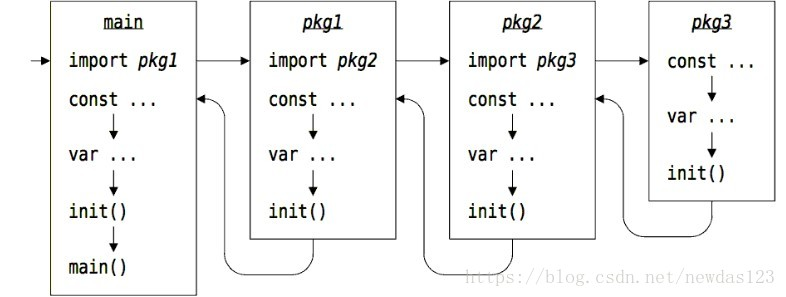
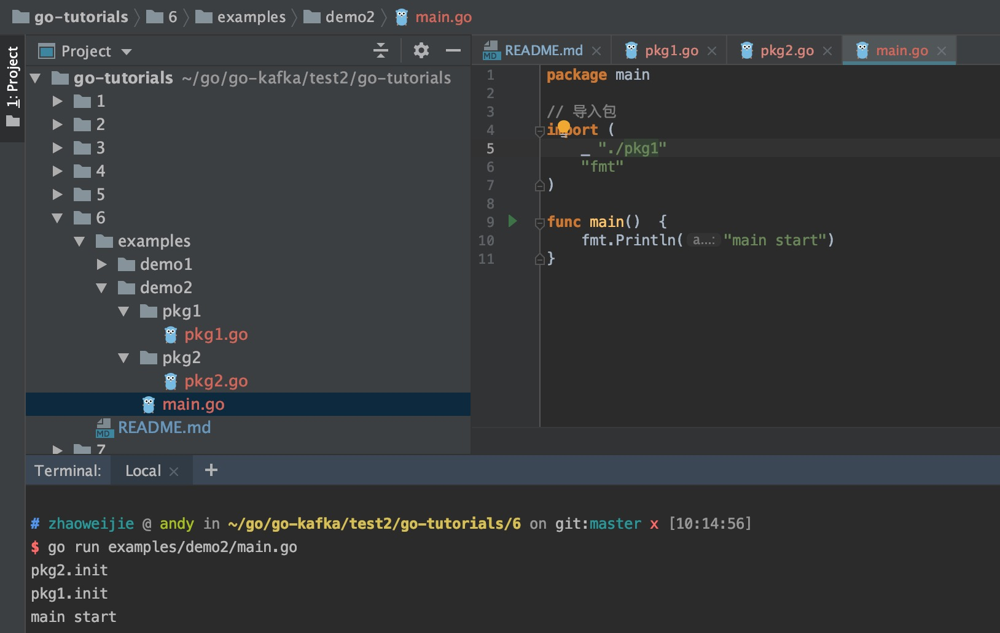

## 6. 包(package)

```
1. 什么是包
2. 自定义包
3. 包中的init函数
4. main包
```

## 1. 什么是包
> 包是把相似或相关的功能放在一起,方便管理代码和避免命名冲突


**包作用**
```go
1. 方便管理代码(模块化开发)
2. 避免重复命名(命名冲突)
3. 各个包中的代码相互不影响
4. 控制访问权限
5. 开箱即用(引入便可以直接使用)
6. 让程序便的简短清晰
7. 有利于程序维护
8. 提高代码重用性(供他人使用)
9. 提高编译速度(重新编译只编译实际已更改的程序的较小部分)
```

## 2. 自定义包
> 1. 包必须声明在每一个go源文件的第一行
> 2. 编写自己的包时, 建议用短小的名字，建议不要使用_(下划线)
> 3. 可导出标识符: 即想在一个包里引用其他包里的标识符(变量、常量、类型、结构体、函数等)时, 必须将标识符名字首字母大写

**将包里的标识符(变量、常量、类型、结构体、函数等)的首字母大写就可以让引用者使用这些标识符了**
```
// 声明包
package package_name
package 包名
```

```
// 导入包
import package_name
import "包名"
```

###### 自定义包示例
> 1. 创建目录 mkdir tests并进入 cd tests
> 2. 创建包文件demo/demo.go
> 3. 创建入口文件main.go
> 4. 运行 go run main.go
```
tests
    demo
      demo.go
main.go

tests                  测试目录
├─demo                  demo包目录
│  ├─demo.go              核心语言包目录
├─main.go       go入口文件

```
> 1. 创建目录 mkdir -p 06examples/demo1/pkg1
> 2. 创建包文件 06examples/demo1/pkg1/demo.go
```
// 06examples/demo1/pkg1/demo.go
package pkg1

import "fmt"

// 我的一个go语言包
func MyFirstPackage() {
	fmt.Println("my first package")
}
```

> 3. 创建入口文件 06examples/demo1/main.go
```
// 06examples/demo1/main.go
package main

// 导入包
import "./pkg1"

func main()  {
	// 调用 pkg1 包中的MyFirstPackage方法
	pkg1.MyFirstPackage()
}
```
> 4. 运行 go run 06examples/demo1/main.go


## 3. 包中的init函数
> init函数用于包(package)的初始化,init函数会在包初始化后自动执行, init函数优先级别比main函数高.

> 1. 包的初始化(注册、检测、修复程序状态)
> 2. 每个包可以有0个或者多个init函数
> 3. 包中的每一个源文件可以有0个或者多个init函数
> 4. init函数不能被调用
> 5. 一个包被多次引入,只会被初始化一次(即init函数只会被执行1次)
> 6. 对同一个包中同一个go源文件的init调用顺序是从上到下的
> 7. 对多个包的init执行顺序是按照包的依赖顺序执行(如果包中引入了其他包, 则最后引入的包init最先执行)
> 8. 包中的init函数在main包中的main函数执行之前初始化
> 9. init函数没有参数和返回值

**包init函数示例**


```go
// 06examples/demo2/pkg1/pkg1.go
package pkg1

import "fmt"
import _ "../pkg2"

func init() {
	fmt.Println("pkg1.init")
}
```

```go
// 06examples/demo2/pkg2/pkg2.go
package pkg2

import "fmt"

func init() {
	fmt.Println("pkg2.init")
}
```

```go
// go run 06examples/demo2/main.go
package main

// 导入包
import (
	_ "./pkg1"
	"fmt"
)

func main()  {
	fmt.Println("main start")
}
```

## 4. main包
> main包是go语言的可执行程序入口包.
> main包main函数是go语言的可执行程序入口包的入口函数.
> main函数没有参数和返回值

**main包main函数特点**
> 1. main函数是go语言生成可执行程序的入口函数
> 2. main函数不能被其他函数调用
> 3. 包init函数执行后才会执行main函数

```go
package main

// 导入包
import (
	"fmt"
)

func init() {
	fmt.Println("init start")
}
func main()  {
	fmt.Println("main start")
}

/*
$ go run main.go
init start
main start
*/
```
