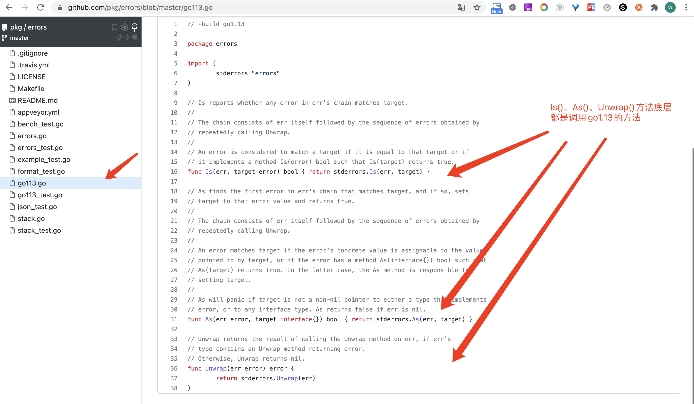

# Golang如何优雅地处理错误和日志

很多人吐槽Go语言错误处理太繁琐了，代码里面到处都是错误判断”if err != nil“。

> Go语言错误是通过返回值，强迫调用者立即对错误进行处理。要么忽略，要么立即处理。相信大家在平时开发也好，在开源项目中也好都能看到 到处都是 if err != nil的判断。我们开发时要注意：不要只检查错误，要优雅地处理错误，我们可以通过消除错误来消除错误。接下来我们就来一起来优雅地处理错误。

```
1. 通过消除错误来优雅地处理错误，避免到处是if err != nil
2. Wrap Errors
3. 如何优雅的Wrap Errors
4. 如何优雅地处理日志
5. 错误总结
```

## 1.通过消除错误来优雅地处理错误，避免到处是if err != nil

```
1.1.方法签名一致直接返回就好

1.2.如果一个函数或方法太复杂，内部需要调用多个方法。可以提供一个Err()方法在最后调用Err()返回错误
```

### 1.1.方法签名一致直接返回就好

```go
func AuthenticateRequest(r *Request) error {
	err := authenticate(r.User)
	if err != nil {
		return err
	}
	return nil
}
```

以上代码判断错误看似没有问题，只做了错误判断处没有额外的逻辑，方法签名一致，这个时候我们之间返回不就好了。

```go
func AuthenticateRequest(r *Request) error {
  return authenticate(r.User)
}
```

### 1.2.如果一个函数或方法太复杂，内部需要调用多个方法。可以提供一个Err()方法在最后调用Err()返回错误

```go
func CountLines(r io.Reader) (int, error) {
  var (
    br = bufio.NewReader(r)
		lines int
    err   error
  )

  for {
    _, err = br.ReadString('\n')
    lines++
    if err != nil {
      break
    }
  }

  if err != io.EOF {
    return 0, err
  }
  return lines, nil
}
```

```go
func CountLines(r io.Reader) (int, error) {
  sc := bufio.NewScanner(r)
  lines := 0
  
  for sc.Scan() {
    lines++
  }
  
  return lines, sc.Err()
}
```

通过以上2个示例发现，每个方法调用就这样处理，就成了大家吐槽，Go语言到处都是if err != nil。小伙伴不信的话去看 Go 很多项目都是这样写，现在可能好点了，早起的Go项目大多数都写的。


## 2.Wrap Errors

### 为什么要使用 wrap error

```
1.底层抛出来了一个 error 你不知道是一个什么错误从哪里抛出来的，因为缺少了上下文。

2.有时候我们希望保留原始错误，又想携带更多的信息
```

Wrap Error 是 Go 1.13中新增的特性，为了让我们优雅地处理业务逻辑中的错误。因为一些历史原因，go 1.13 wrap error不支持获取堆栈信息。后面我们一起使用”pkg/errors“和 go 1.13结合来处理错误。


```
2.1.如何生成Wrap Error
2.2. Is()方法
2.3. As() 方法
2.4. Unwrap() 方法
2.5. github.com/pkg/errors包与go 1.13 error 结合使用
```

### 2.1.如何生成Wrap Error

> fmt.Errorf()：包装一个错误

````go
// 包裹错误
err := errors.New("raw error")
errWrap1 := fmt.Errorf("wrap1 \n%w", err)
errWrap2 := fmt.Errorf("wrap2 \n%w", errWrap1)

fmt.Println(errWrap1)
fmt.Println()
fmt.Println(errWrap2)
/*输出：
wrap1 
raw error

wrap2 
wrap1 
raw error
*/
````

### 2.2. Is()方法

当错误被 Wrap Error后我们上层没办法知道底层错误是什么，Is方法就是做这个事的。

Is()方法：检测 一个 error 是否包含指定的错误

```go
// errors.Is(err, target error) bool
err := errors.New("raw error")
errWrap1 := fmt.Errorf("wrap1 \n%w", err)
errWrap2 := fmt.Errorf("wrap2 \n%w", errWrap1)

fmt.Println(errors.Is(errWrap1, err))// true
fmt.Println(errors.Is(errWrap2, errWrap1))// true
fmt.Println(errors.Is(errWrap2, errors.New("raw error")))// false
```

### 2.3. As() 方法

当我们使用 Wrap Error错误后，没办法直接使用断言去判断底层错误是啥。

As()：把错误转换成指定的目标错误，类似于断言。

```go
// errors.As(err error, target interface{}) bool
err := errors.New("raw error")
errWrap1 := fmt.Errorf("wrap1 \n%w", err)
errWrap2 := fmt.Errorf("wrap2 \n%w", errWrap1)

errWrapAs := errors.New("raw error")
var perr *os.PathError

fmt.Println(errors.As(errWrap2, &errWrapAs))// true
fmt.Println(errors.As(errWrap2, &perr))// false
```

### 2.4. Unwrap() 方法

Unwrap() ：返回外层的error

```go
// errors.Unwrap(err error) error
err := errors.New("raw error")
errWrap1 := fmt.Errorf("wrap1 \n%w", err)
errWrap2 := fmt.Errorf("wrap2 \n%w", errWrap1)

fmt.Println(errors.Unwrap(errWrap2))
fmt.Println()
fmt.Println(errors.Unwrap(errors.Unwrap(errWrap2)))
/*
wrap1 
raw error

raw error
*/

```

### 2.5. github.com/pkg/errors包与 go 1.13 error 结合使用

”pkg/errors“对go 1.13 error做了兼容，所以我们可以直接使用”pkg/errors“


```go
pkg/errors.New()：创建包含堆栈信息的错误
pkg/errors.Wrap()：打包一个包含堆栈信息的错误
pkg/errors.WithMessage()：使用Message包装错误错误，不包含堆栈信息
```

```go
package main
import (
  "fmt"
  pkgErrors "github.com/pkg/errors"
)

func main() {
  err := pkgErrors.New("raw error")// 创建错误会包含堆栈信息
  fmt.Printf("%+v", err)
}
/**输出：
raw error
main.main
    /Users/zhaoweijie/work/develop/go/hello/main.go:10
runtime.main
    /usr/local/Cellar/go/1.16/libexec/src/runtime/proc.go:225
runtime.goexit
    /usr/local/Cellar/go/1.16/libexec/src/runtime/asm_amd64.s:1371% 
*/
```

```go
package main
import (
  "errors"
  "fmt"
  pkgErrors "github.com/pkg/errors"
)

func main() {
  err := errors.New("raw error")
  wrapErr := pkgErrors.Wrap(err, "wrap 1") // pkg error wrap 打包错误会包含堆栈信息
  fmt.Printf("%+v", wrapErr)
}
/**输出：
raw error
wrap 1
main.main
    /Users/zhaoweijie/work/develop/go/hello/main.go:12
runtime.main
    /usr/local/Cellar/go/1.16/libexec/src/runtime/proc.go:225
runtime.goexit
    /usr/local/Cellar/go/1.16/libexec/src/runtime/asm_amd64.s:1371
*/
```

```go
package main
import (
  "errors"
  "fmt"
  pkgErrors "github.com/pkg/errors"
)

func main() {
  err := errors.New("raw error")
  wrapErr := pkgErrors.WithMessage(err, "wrap 1") // 不会包含堆栈信息
  fmt.Printf("%+v", wrapErr)
}
/**输出：
raw error
wrap 1
*/
```

## 3.如何优雅的Wrap Errors

为了避免多次wrap带来的性能影响和日志变得司空见惯，导致日志中有很多不必要的日志产生的噪音。

我们应该遵守以下wrap error的使用规则

```
3.1.在标准库、第三方库、基础库、kit库产生的错误应该直接返回，而不应该wrap。
3.2. 在应用层代码中如果你调用了标准库、第三方和基础库产生的错误，你应该使用pkg errors.wrap()返回错误
3.3.如果你调用了本包的其他函数，你不应该wrap
3.4.在应用层代码中，如果你判断某个业务逻辑产生了一个错误，你应该使用 pkg errors.New()返回错误
```

### 3.1.在标准库、第三方库、基础库、kit库产生的错误应该直接返回，而不应该wrap。

如果在标准库、第三方库、基础库、kit库中如果你wrap，调用者不知道有没有wrap，再去wrap了，如果该包被其他包引入，导致被wrap多次。


### 3.2. 在应用层代码中如果你调用了标准库、第三方和基础库产生的错误，你应该使用pkg errors.wrap()返回错误

```go
import (
  pkgErrors "github.com/pkg/errors"
)
func Service() error {
  _, err := http.Get("http://notfound.comerr")
  return pkgErrors.Wrap(err, "http.get error")
}
```

### 3.2.如果你调用了本包内的其他函数，你不应该wrap

```go
package service

import (
  "github.com/pkg/errors"
)

func service() error {
  err := serviceDemoFun()
  // 调用了本包（service）的其他函数，你不应该wrap
  if err != nil {
    return err
  }
  // 业务代码
  return nil
}

func serviceDemoFun() error {
  return errors.New("service demo fun raw error")
}
```

### 3.3.在应用层代码中，如果你判断某个业务逻辑产生了一个错误，你应该使用 pkg errors.New()返回错误

```go
import (
  "github.com/pkg/errors"
)

func service() error {
  str := ""
  if str == "" {
    return errors.New("serviceDemoFun result value is empty")
  }
  return nil
}

```


## 4.如何优雅地处理日志

```
4.1.直接返回错误，而不是在每个产生错误的地方记录日志
4.2.错误应包含足够并且有效的上下文信息
4.3.在应用程序的顶部记录日志
4.4.在 goroutine 的入口处记录日志
```

### 4.1.直接返回错误，而不是在每个产生错误的地方记录日志

```go
package main
import (
  "fmt"
  "log"
  "github.com/pkg/errors"
)

func main() {
  wrapErr := service()
  fmt.Printf("%+v", wrapErr)
}

// 应用层服务
func service() error {
  err := domain()
  if err != nil {
    log.Printf("%s %v", "service error", err)
  }
  // 业务代码
  return err
}

// 业务逻辑层
func domain() error {
  err := dao()
  if err != nil {
    log.Printf("%s %v", "domain error", err)
  }
  // 业务代码
  return err
}

// 数据层
func dao() error {
  err := errors.New("dao raw error")
  log.Printf("%v", "dao raw error")
  return err
}
/*
2021/08/27 01:18:35 dao raw error
2021/08/27 01:18:35 domain error dao raw error
2021/08/27 01:18:35 service error dao raw error
dao raw error
main.dao
    /Users/zhaoweijie/work/develop/go/hello/main.go:38
main.domain
    /Users/zhaoweijie/work/develop/go/hello/main.go:27
main.service
    /Users/zhaoweijie/work/develop/go/hello/main.go:17
main.main
    /Users/zhaoweijie/work/develop/go/hello/main.go:11
runtime.main
    /usr/local/Cellar/go/1.16/libexec/src/runtime/proc.go:225
runtime.goexit
    /usr/local/Cellar/go/1.16/libexec/src/runtime/asm_amd64.s:1371%  
*/

```

修改后

```go
package main

import (
  "log"
  "github.com/pkg/errors"
)

func main() {
  wrapErr := service()
  log.Printf("%s %v", "service error", wrapErr)
}

// 应用层服务
func service() error {
  err := domain()
  // 业务代码
  return err
}

// 业务逻辑层
func domain() error {
  err := dao()
  // 业务代码
  return err
}

// 数据层

func dao() error {
  err := errors.New("dao raw error")
  return err
}
```

### 4.2.只记录错误必要的上下文信息

> 1. 比如不应该记录http接口的响应结果，因为99%以上的错误都可以通过请求参数找到错误原因
> 2. 比如一个方法有5个参数，但是与错误有关的只有2个参数。这时候日志应该记录与错误有关的2个错误参数


### 4.3.在应用程序的顶部记录日志

```go
package main

import (
  "log"
  "github.com/pkg/errors"
)

func main() {
  // 在顶层处理错误
  wrapErr := service()
  log.Printf("%s %v", "service error", wrapErr)
}

// 应用层服务
func service() error {
  return domain()
}

// 业务逻辑层
func domain() error {
  return dao()
}

// 数据层
func dao() error {
  return errors.New("dao raw error")
}
```

### 4.4.在goroutine的入口处记录日志

```go
package main

import (
  "errors"
  "log"
)

func main() {
  Go(func() error {
    panic("goroutine1 panic error")
  })

  Go(func() error {
    return errors.New("goroutine2 error")
  })

  for {
  }
}

func Go(x func() error) {
  go func() {
    var err error
    // 在goroutine的入库出记录日志
    defer func() {
	    if errFatal := recover(); errFatal != nil {
        log.Printf("%+v", errFatal)
      }
      if err != nil {
        log.Printf("%+v", err)
      }
    }()
    err = x()
  }()
}
/**输出：
2021/08/27 01:42:31 goroutine2 error
2021/08/27 01:42:31 goroutine1 panic error
*/

```

## 5.错误总结

```
1. 优先处理失败，而不是成功
2. 完全控制代码中的错误，做你想做的任何事
3. 将错误作为一等公民，强迫调用者立即处理错误
4. 没有隐藏的控制流
5. 错误应该只处理一次（记录日志也算，wrap错误也算）
6. 如果你吞掉了一个错误，你应该保证程序100%的完整性
7. 第三方库、基础库、kit库中产生的错误不应该wrap
8. 在应用层中调用第三方库产生的产生了一个错误应该wrap
9. 在应用层中判断业务逻辑产生了一个错误，你应该wrap
10. 如果你调用了本包的其他函数，你不应该wrap
11. 直接返回错误，而不是在每个产生错误的地方记录日志
12. 错误应该只记录必要的上下文
13. 在应用程序的顶部记录日志
14. 在goroutine的入口处记录日志
```
