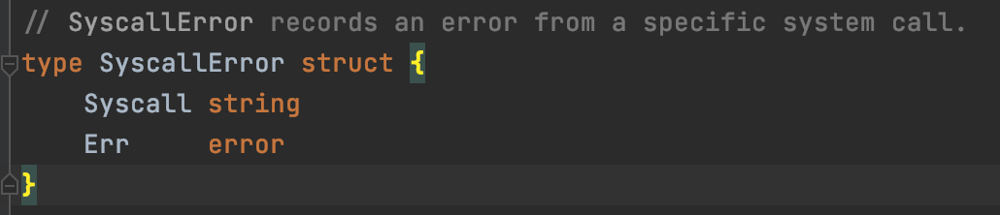
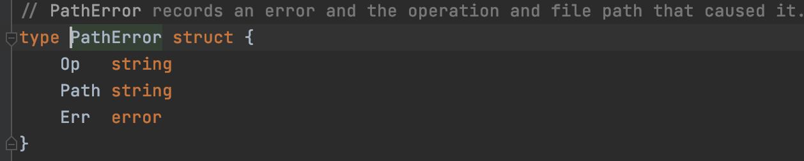

# Go 错误处理3种套路

1. Sentinel Errors（哨兵错误）
2. Error Types（自定义错误类型）
3. Opaque Errors（非透明错误）


## 1.Sentinel errors（哨兵错误）

计算机编程中使用一个特定的值来表示不可能进一步处理的做法叫Sentinel Error（哨兵错误）。如C语言中我们常常返回一个整数值表示成功还是失败。

通过下面代码我们得出结论，如果使用 Sentinel Error 我们会向下面这样判断，导致写死在代码中，如果这时候方法的作者觉得错误值不合理，把错误值改了。导致调用者也会更改。所以我们永远不应该使用检测error.Error的输出

```go
err := saveUser()
switch err {
  case "User Not Found In Database":
    fmt.Println("User Not Found")
  case "Save User to Database Fail":
    fmt.Println("User Not Found")
  default:
    fmt.Println(err.Error())
}
```

Sentinel Error用法：使用errors.New创建错误，并赋值给Err前缀的变量。

io包中的示例：var EOF = errors.New("EOF")
```go
var ErrUserNotFound = errors.New("User Not Found In Database")
var ErrSaveUserFail = errors.New("Save User to Database Fail")
err := saveUser()
switch err {
  case ErrUserNotFound:
    fmt.Println("User Not Found In Database")
  case ErrSaveUserFail:
    fmt.Println("Save User to Database Fail")
  default:
    fmt.Println(err.Error())
}
```

使用Sentinel Error最不灵活，调用者只能做等值判断，有时候我们只有错误值，没法判断具体的错误在哪儿，这个时候Sentinel Error 没办法为我们需要更多的上下文。结论我们应该尽可能避免 Sentinel Error。

Sentinel Error的特点：
```
1. 只能做等值判断
2. 无法做断言
3. 无法提供更多的上下文信息
4. 创建包与包之间的依赖
5. 成为公共API的一部分，增加了包的表面积
  5.1. 如果API的公共函数或者方法返回特定错误
  5.2. 如果API的接口返回了 Sentinel Error 错误，该接口的实现也被限制返回Sentinel Error 错误。
```

Sentinel Error应用场景：

```
1. 应用不会有第三方导入包，这个时候我们可以使用 Sentinel Error
2. 如果API只有一种错误，也不需要携带上下文，不需要断言我们可以使用 Sentinel Error
```

## 2. Error Types（自定义错误类型）

Error type 就是实现了 error 接口的自定义类型。

有时候我们想要携带更多的上下文信息，使用Sentinel Error无法做到。结论虽然 Error Type比 Sentinel Error携带了更多得错误信息，但是 Error Type 和 Sentinel Error有相同的问题。如果实在无法避免，至少应该避免公开Error Type。

以下是参考网上文章的代码，也可以去看 fs.PathError和 os.SyscallError。

```go
type MyError struct {
    Msg string
    File string
    Line int
}
func (e *MyError) Error() string {
    return fmt.Sprintf("%s:%d: %s”, e.File, e.Line, e.Msg)
}
                       
err := something()
switch err := err.(type) {
  case nil:
    // call succeeded, nothing to do
  case *MyError:
    fmt.Println(“error occurred on line:”, err.Line)
  default:
    // unknown error
}
```






Error Type的特点

```
1. 可以携带更多的上下文信息
2. 可以使用断言或者类型切换，但是必须公开 Error Type
3. Error Type 和 Sentinel Error有相同的问题
4. 实在无法避免，至少应该避免公开 Error Type
```

## 3. Opaque Errors（非透明错误）

调用者知道发生了错误，但是无法看到错误的内部。调用者只知道关于操作的结果是成功还是失败。我们称为Opaque Error（非透明错误）

为了让代码和调用之间的依赖最少，使用简单。

```go
type temporary interface {
  Temporary() bool
}

// 如果 err 是临时的，IsTemporary 返回 true。
func IsTemporary(err error) bool {
  te, ok := err.(temporary)
  return ok && te.Temporary()
}
```

Opaque Error的特点
```go
1.代码和调用之间的依赖最少
2.使用简单开箱即用
3.判断行为，而不是类型
4.只有断言行为的方法，才会成为公共API
```

```go
1. 在日常开发中我们建议使用 Opaque Errors（非透明错误）
2. 如io包中的io.EOF，适用 IsEOF() 方法判断就比使用 Sentinel Error更好
```

参考文章：[Don’t just check errors, handle them gracefully](https://dave.cheney.net/2016/04/27/dont-just-check-errors-handle-them-gracefully)
