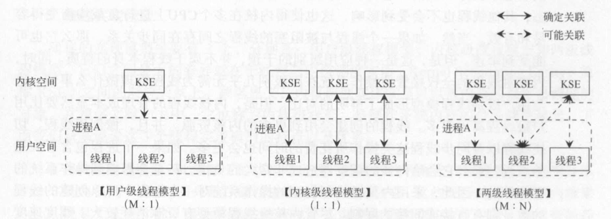

# 基础术语

```
1. 什么是并发
2. 为什么要使用并发编程
3. 什么是 串行、并发、并行
4. 什么是进程、线程、协程
5. 进程和程序的区别
6. 操作系统怎么实现并发
7. 并发编程模型
8. 并发编程有什么风险
9. 什么时候适合使用并发编程
10. 并发问题
  10.1 竞态条件
  10.2 临界区
  10.3 原子操作
  10.4 锁（互斥锁、读写锁）
  10.5 同步、异步
  10.6 堵塞与非堵塞（线程内调用）
  10.7. 死锁、饥饿锁、活锁
  10.8. 线程安全、线程不安全、可重入函数
```

## 1. 什么是并发

```
多个任务同时执行，使资源利得到充分的利用以便能更快的得到结果。
并发是一种思维，不限于特定的领域，对编程来说，也不限于于特定的编程语言。

示例：在日常中很多，这里我们以烧水为例
用水壶烧水的时候，我们就会去看书、看电视或者做其他的
等水壶铃声响的时候，我们就知道水开了。
没有傻傻的一直在那里等水烧开，在做其他事吧。
```

## 2. 为什么要使用并发编程

```
提高硬件利用率，减少任务完成的总时间，提高程序运行速度。

1. 提高硬件利用率
  在写代码的时候，我们可以播放音乐
  下载游戏的时候，我们一边下载，一边看视频等

2. 减少任务完成的总时间
  比如烧水要花10分钟，看书也要花10分钟
  1. 我们先烧水，一直等水烧好， 在去看书。这是我们要花20分钟。
  2. 我们烧水打开开关后就去看书，等水烧好了我们在回去喝水。这是可能只需要11分钟就完成。
  因为烧水的只需要我们打开开关就好，剩下的就是等待。

3. 让程序变得简单
  每个任务单独编写程序比多个任务混在一起编写要简单的多。
```

## 3. 什么是 串行、并发、并行

```
串行：在一段时间内，执行一个任务的同时，不能执行其他任务，
只能等到一个任务完成才能执行下一个任务。

示例：很多人向一个账号转账
```

```
并发：在一段时间内，多个任务交替执行（我们看起来是同时）

例如：CPU交替执行程序（一边下载文件，同时播放音乐）
```

```
并行：同一时刻，同时执行多个任务

例如：多核cpu，在不同cpu上执行任务
不同的计算机执行多个任务
```

4. 什么是进程、线程、协程、单线程多线程

```
进程：运行中的程序，它是程序的执行过程，也是操作系统资源分配的基本单位。上下文开销比较大
```

```
线程：进程中的执行单元，也是操作系统调度的最小单位。上下文切换进程快
一个进程中可以包含多个线程
```

```
协程：一种用户态的轻量级线程，协程调度用用户完全控制。上下文切换非常快
```

```
多线程：一个程序包含多个执行单元
单线程：一个程序只包含一个执行单元
```

## 5. 进程和程序的区别

```
1. 进程是动态的，进程是运行中的程序
2. 程序是静态的，程序是一些保存在硬盘上的可执行代码
```

## 6. 操作系统怎么实现并发

```
系统启动多个程序交替执行
cpu不停的切换程序，执行程序这个2个步骤。
```

## 7. 并发编程模型

```
1. 内核级线程
2. 两级线程
3. 用户级线程
```

```
内核级线程模型（1：1）：线程是由操作系统内核负责管理的，它们是内核的一部分。
应用程序对线程的创建、终止都必须通过内核提供的系统调用来完成。
进程中的每一个线程都与一个kse对应，因此内核可以对每一个线程进行调度。
又称为1对1(1:1)模型实现

特点：
1. 并行运行（多个线程能够运行在多个cpu上）
2. 如果一个进程大量创建线程，会给调度器带来非常大的负担
3. 线程创建的数量有直接或限制
```

```
用户级线程模型（M：1）：线程是由应用程序完成的，也就是说有用户级的线程库提供调度管理。
线程库不是内核的一部分，而是存储在进程的用户空间中。这些线程的存在对内核来说无法感知，
内核也就无法调度这些线程，对线程的管理协调完全是由用户级程序自助行为。应用程序创建、终止
协调都不需要让cpu从用户态切换到内核态。

特点：
1. 可移植性好（可以在不支持线程的操作系统中实现）
2. 速度快（线程的创建、销毁、切换消耗资源少，这些状态只在当前线程本地保存）
3. 线程管理灵活（允许定制自己的调度算法）
4. 线程发生I/O堵塞时，由于内核无法感知。从而会堵塞整个进程，导致所有的线程堵塞。
```

```
两级线程模型（M：N）：取前面两种模型的精华，并去二者的劣势，也就是多对多的线程实现。
在此模型下，一个进程可以与多个KSE关联，这点和内核线程模型相似。但是与内核级线程模型
不同的是，进程中的线程（以下简称应用程序线程）并不与KSE一一对应，这些应用线程可以映射
到多个已关联的KSE上。两级线程模型会通过操作系统创建多个内核级线程。然后通过这些内核级
线程对应用程序线程进行调度。这个样的设计，内核资源的消耗大大减少，同时提高了线程管理
的效率。两级线程模型的复杂性，往往不会被操作系统内核的开发者采用。这样的模型却很好的
在编程语言上实现，充分的发挥应有的作用。Go的并发编程模型就和两级模型非常相似。只不过它的
具体实现方式更加高级和优雅一些。在Go的并发编程模型中，Go的执行单元不受操作系统管理，
我们称为Goroutine
```


## 8. 并发编程有什么风险

```
1. 安全性
  多个任务（可能是进程、线程、携程）共享数据时，可能产生不符合预期的结果。

2. 不确定性
  单线程程序中所有代码的执行顺序是固定的，而并发程序中所有代码的执行顺序是不确定的。
  你不知道谁先谁后。导致每次执行程序的顺序都是不固定，就算输入相同的数据。

3. 性能
  并发编程不是“空手套白狼”，它也是有开销的。他们在上下文切换，会消耗一定的资源和时间。

4. 复杂性
  单线程所有的变量值都可以本地拿到，执行的时候也不需要和别人打交道。
  多线程之间一旦需要协同工作，在加上前面所说 安全性、不确定性等问题，
  就会大大增加程序的复杂性，这也是并发编程难度所在。
```

## 9. 什么时候适合使用并发编程

```
1. 任务会堵塞，导致之后的代码无法执行（例如：BFF调用多个下游服务，为了提高效率会使用errGroup并发请求下游服务）
2. 任务执行时间过长，可以划分为多个子任务。（例如：分段下载）
3. 任务本身需要协作（例如：生成者消费者问题）
```

## 10. 并发问题

```
10.1 数据竞争
  多个进程（多个线程）同时对同一个资源进行读写（只读一般不会出问题），造成程序运行结果错误。
  这种错误我们称为竞态。
  
10.2 临界区
  产生数据竞争的代码块，或者说只能被串行访问的某段代码，我们称为临界区。
  临界区对是否可以被中断没有强制的规定. 它只要保证一个访问者在临界区中时, 
  其他访问者不会被放进来就可以了. 

  
10.3 原子操作
  执行过程中不能中断的操作称为原子操作。
  
10.4 锁（互斥锁、读写锁）
  锁：计算机协调多个进程或线程访问某一个资源的一种机制
  互斥锁：保证临界区只有一个访问者的做法
  读取写锁：多个线程访问同一个资源，同一时刻只能有一个写入，其他区操作将等待。
  
10.5 同步、异步
	同步：调用者必须等待被调用的方法返回后，才执行后续的行为。
  异步：调用者调用某个方法后立即返回，让调用者可以继续后续操作。
  
10.6 堵塞与非堵塞（线程内调用）
  阻塞调：是指调用结果返回之前，当前线程会被挂起。调用线程只有在得到结果之后才会返回。
  非堵塞：是指调用不能立刻得到结果之前，该调用不会阻塞（不会被挂起）当前线程。
  
同步阻塞：小明一直盯着下载进度条，到 100% 的时候就完成。 - 同步体现在：等待下载完成通知。 - 阻塞体现在：等待下载完成通知过程中，不能做其他任务处理。
同步非阻塞：小明提交下载任务后就去干别的，每过一段时间就去瞄一眼进度条，看到 100% 就完成。 - 同步体现在：等待下载完成通知。 - 非阻塞体现在：等待下载完成通知过程中，去干别的任务了，只是时不时会瞄一眼进度条。【小明必须要在两个任务间切换，关注下载进度】

异步阻塞：小明换了个有下载完成通知功能的软件，下载完成就“叮”一声。不过小明不做别的事，
  仍然一直等待“叮”的声音。 - 异步体现在：下载完成“叮”一声通知。 
  - 阻塞体现在：等待下载完成“叮”一声通知过程中，不能做其他任务处理。

异步非阻塞：仍然是那个会“叮”一声的下载软件，小明提交下载任务后就去干别的，  
  听到“叮”的一声就知道完成了。 - 异步体现在：下载完成“叮”一声通知。 
  - 非阻塞体现在：等待下载完成“叮”一声通知过程中，去干别的任务了，只需要接收“叮”声
  通知即可。【软件处理下载任务，小明处理其他任务，不需关注进度，只需接收软件“叮”声通知，
  即可】

10.7. 死锁、饥饿锁、活锁
   死锁：多个线程相互等待锁，导致永远无法退出。
   原因：加锁顺序不一致，同一个线程2次加锁。（go map使用细粒度的锁就很容易造成这种情况，因为go map是无序的，导致每次加锁顺序不一致）
   如何避免死锁：
     1. 固定顺序锁：按照顺序加锁
     2. 锁超时：给锁加上超时时间
     
   饥饿锁：某个线程一直拿不到锁，导致一直无法执行。
   
   活锁：线程不断重复执行相同的操作，由于条件没满足，导致每次操作结果失败。
   
10.8. 线程安全、线程不安全、可重入函数
   线程安全：一个代码块它能能够被多个线程并发执行，并且总数能得到预期的结果。
   
   线程不安全：一个代码块它可以被多个线程并发执行，但是可能产生错误的结果。
   
   可重入函数：多线程并发调用一个函数，无论该函数以任意顺序调用，该函数都能得到预期的结果，
   那么该函数就是可重入函数
```
