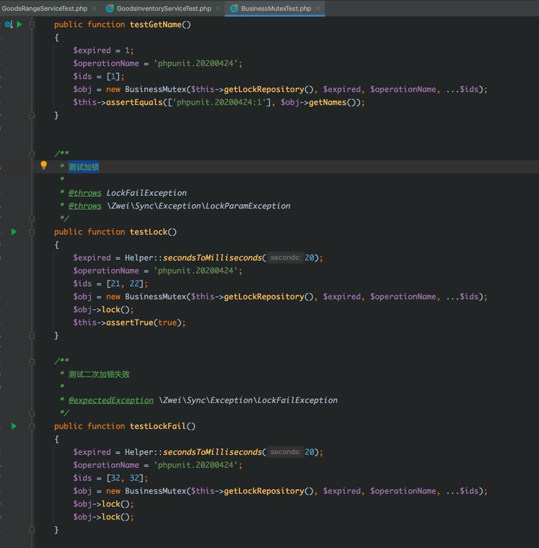
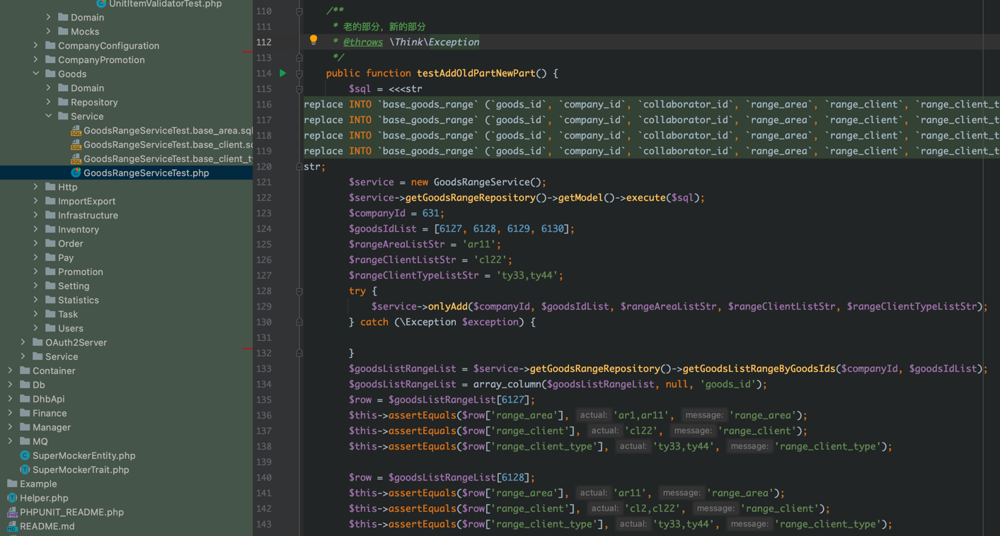
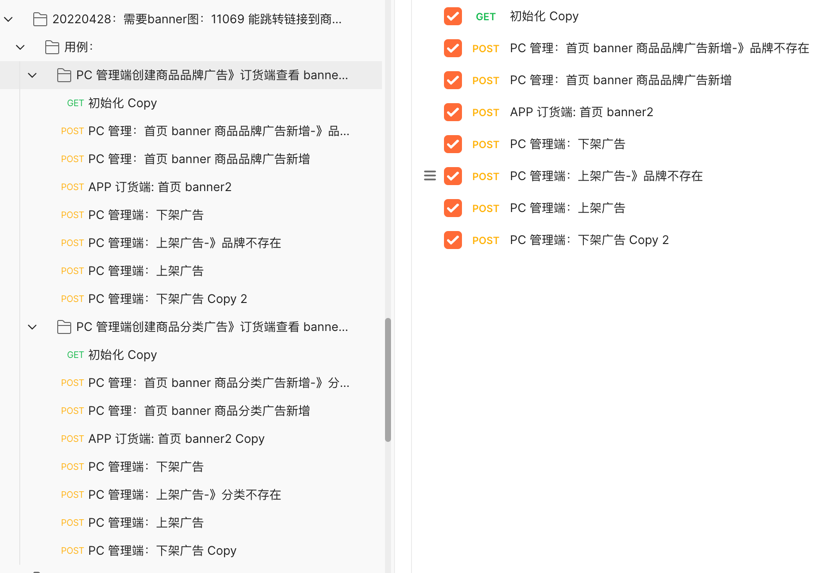
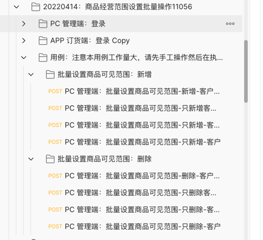
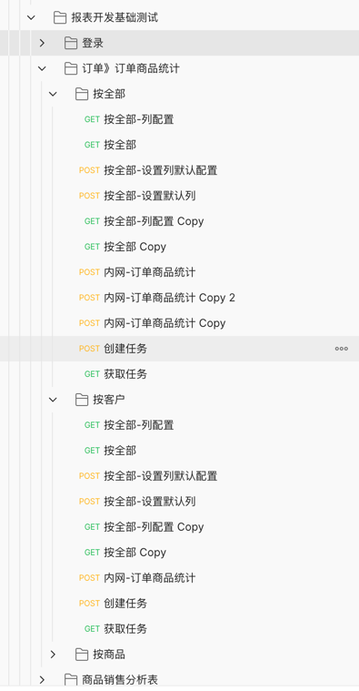

# 自己的小孩自己养
> 目的：尽快检查程序的错误，减少 bug，提高开发效率，提升软件质量，保证开发交付给测试的版本尽可能的达到上线标准。

```
1. 目的
2. 自测中的问题
3. 如何保证测试质量
4. 如果提高测试效率
```

## 1. 目的
```
尽快检查程序的错误，减少 bug，提高开发效率，提升软件质量，保证开发交付给测试的版本尽可能的达到上线标准。
```

## 2. 自测中的问题

```
怎么开始测试（从最容易的开始，迅速找出程序问题）
    刚开始自测时由于任务时间都很紧张，使用手工测试效率低，而且重复工作量大。
    就是使用采用了 yapi 做自动化测试，虽然能满足要求，但是效率不高，后面使用了postman 
    虽然比较灵活，但是效率还是不高。使用 yapi 和 postman刚开始写自动化测试时候都会导致开发效率低下。
    后面利用周末使用了 PHP 写了一个自动化测试工具，只解决了一部分问题还是不理想。最后选择使用 postman。

    1.通过复制接口 curl 提高效率。
    2.先测试简单的用例（比如 测试接口正常，验证接口特定场景返回值）。
    3.通过半自动来自测。
    通过以上3种方式累积了一定经验，然后丰富用例库，通过不断的摸索，发现很多重复的工作量。
    
    示例1：如做报表时，很多接口要做分页测试，工作简单大量的重复，就采用先获取10条数据，然后再
    分成5页，每页2条数据。一次取10条，和每页2条数据的1，2，3页数据对比，一样就验证通过。
    
    示例2：如报表自动化测试只测试部分正确的过滤条件，其他的采用手工
    示例3：如商品经营范围，因为单元测试覆盖了所有的用例，postman数据采用半自动化测试来提高效率。
    示例4：多规格产品过多，展示方式优化采用 PC 端设置数据，APP订货端验证返回值
    示例5：能跳转链接到商品分类，能跳转到组合商品。PC管理端新增数据，APP订货端验证逻辑。
    
    然后丰富用例库，通过不断的摸索，总结，丰富用例库解决了大量的重复的工作和累积自动化测试经验。
    提高开发的时候自测和开发效率更高总结了一下几条经验：
        1.传递正确的参数来验证程序中的核心功能（即先测试核心功能，在测试辅助功能）
        2.先测试部分更变，在测试没有变化的部分
        3.先测试功能，再测试可靠性
        4.先测试常见的错误，在测试罕见的错误
    
    阅读测试用例的时候需要，按照测试同学的用例去理解测试。中间需要翻译过程。这个只能多看测试同学的用例。

```


## 3. 如何保证测试质量
```
1.尽可能的覆盖所有测试用例
2.大量重复的用例使用单元测试保证所有用例正确执行
3.可能使用单侧+集成测试来保证软件质量
4.通过单一职责和分层来降低程序的复杂度，越简单的代码越容易测试。
```

## 4. 如果提高测试效率
```

1.只写必要的测试
    只写业务逻辑复杂的测试
    只写自己觉得"没谱"的代码测试
    只写自己觉得”可能“产生 bug 的代码测试
    
2.只写关键的测试
    有时候必要测试写不出来，但是关键性测试不要省，你至少应该写业务代如果一切顺利且最重要的正确逻辑的代码测试（你至少保证了最重要的那条逻辑是可以走通的。）
    比如：太复杂了老代码
    

3.无用的测试
    不要去测试语言的核心库和／或标准库函数，因为这些代码都是久经考验的。
    不要去测试框架的基础类或工具方法，道理和第一条类似,知名的框架都有很完善的自身测试,否则你也不敢用不是
    不要.去测试外部依赖的有效性（如果你的测试一定需要外部依赖, 你首先应该考虑伪造它）
    最后还有一种测试是"无用"的，就是从来只见它(通过)没见过它(失败)的测试.你自己都没意识到这种测试可能从头到尾都没有测试任何代码
    
4.和数据库相关并且复杂的不建议 mock
    这时候我们可以，使用 Navicat 复制 复制 ”insert“ 语句，把 ”insert“ 语句替换成 ”replace“ 语句
5.大量重复的用例使用单元测试覆盖所有用例比集成测试和自动化测试简单
6.postman 集成测试先测试核心功能，在测试辅助功能
7.postman 集成测试遇到复杂的测试通过半自动来测试
8.避免在测试脚本中使用复杂的脚本（因为自动化测试本身是一种软件开发，软件就会产生 bug，所以我们要避免复杂的自动化测试脚本）
```








